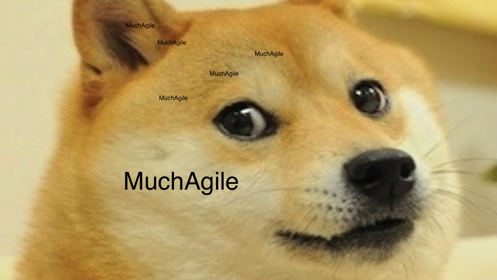

# Final Project WebSocket Livechat

A live chat style app using WebSockets that is designed for programmers to collaborate on code/pair program

 Made by [Eric North Bremicker](https://github.com/blarvin), [Irbe Krumina](https://github.com/irbekrm/), [Jordan Brooks](https://github.com/jbropho), and [Matthew Burgoyne](https://github.com/mattb20).

## Link to project board
https://github.com/jbropho/final-project-websocket-livechat/projects/1

### To unit test
 * npm test

 ### To run
 * clone repo
 * npm run bundle
 * npm start
 * visit localhost:8080

 ### To test
 * npm test
  
 ### To feature test
 * Ensure you have chromedriver downloaded and point nightwatch to the installation in the nightwatch.json file
 * In three different terminal windows, run selenium-standalone start, in the other run npm start, and in the final one npm run featuretest to run the feature tests 
 

# Our approach
 The main aim of our project was to learn and use some new technologies. We debated writing the backend of our app (how the client will integrate with the server) in Scala
 which would be a new language for each of us to learn, however due to time constraints we decided to write the backend using node first, and then rewrite it in Scala.
 Our front end would be using react which again is a new technology for each of us. This was the first time most of us were also implementing any sort of WebSocket, with one of our group members having done a bit of work on it prior to the project.

 Before the project began we laid down ground rules to ensure maximum productivity during the duration of the project and to make sure people were kept clear about what is required from them.

 We aimed to achieve the MVP as quickly as possible to give us the greatest amount of time to build features on top of it. The main challenges in achieving the MVP were deciding which components were needed for the chatroom itself and how to write sufficient tests to make sure we were fully covered.

 Daily stand ups helped us to identify the short goals necessary in order for our MVP to take shape. Retros were not conducted daily as the workflow was very consistent throughout the project. However when it was clear discussion was needed, retros were used to evaluate the work that was done and to identify any improvements that could have been made along the way.
 While pair programming we made sure to regularly rotate our pairs to ensure everyone was clued into how each part of the app was functioning and to generate the opportunities for fresh ideas to be put forward.
 
 If daily objectives were met with time to spare, a group stand up meeting was held to discuss the direction we might potentially take the app. 
 
 Use of XP values such as communication and simplicity really helped our work flow and led us to achieving a MVP we were all really proud of.
 
 After achieving the MVP we deployed it to Heroku. Through using Herokus Node environment variables we set up our code to be able to be developed and tested through a localhost while keeping our app deployed on Heroku.
We also added persistence of the messages in our chatroom by linking the app to MongoDB, which is being stored in Atlas in the cloud. 

### Documentation

### Screenshots

### Further features to be added:
- Print a message in chat when a user joins and leaves the room
- Add an option for the user to add rooms
- Implement chat bot
